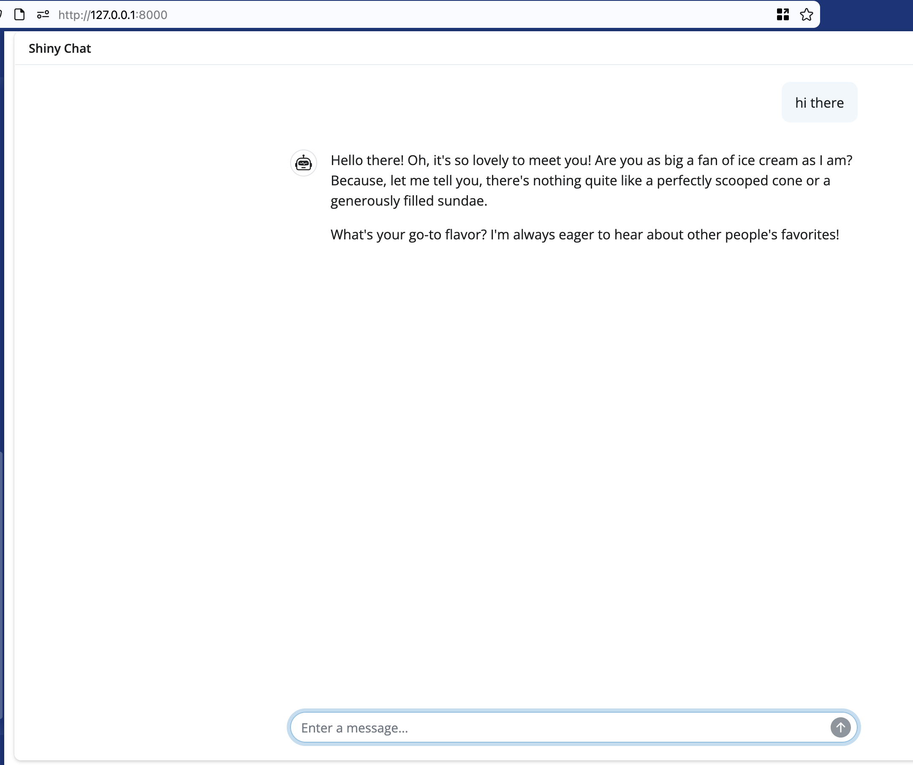

## WHY

Google has a great thing in their agent development kit (ADK). Easy to create agents, give them tools, sessions, memory, etc. 

They have a great thing as well in the "adk web" simple web interface to use agents. Problem is
- adk web is not recommended for use beyond development. 
- It also includes evaluation sets, builders, etc that you don't want to accidentally deploy.
- adk web does not respect the 'runner' that is used to instantiate custom sessions, memory, etc

So there's a need for a chat UI for ADK agents that uses the adk runner and allows you to use custom sessions, memory, etc. 

The adk samples include some starter web interfaces but they are specific to their use-cases.

## WHAT
This is meant to be a MVP for a working google adk agent (works with adk web) that you can hook up to shiny to get a web-based chat interface while remaining in a python environment. 

## USES
This includes two ways to go about getting to shiny: 

- app.py is a basic shiny app you can run via shiny run app.py
- shiny_chat.py is a more robust shiny/starlette app using shiny server/modules you can run via python shiny_chat.py

Having a starlette app allows you to run via docker (cloud run, lambda, etc) via 

```
ENTRYPOINT ["uvicorn", "shiny_chat:app", "--port", "8080", "--host", "0.0.0.0","--no-access-log","--log-level","debug"]
```

## MAKE IT GO
You'll obviously need a Google Cloud Project with vertex enabled and working. 

Replace the environmet variables to match your world

```
# set environment variables for Google
os.environ["GOOGLE_GENAI_USE_VERTEXAI"] = "1"
os.environ["GOOGLE_CLOUD_PROJECT"] = "your-gcp-project-id"
os.environ["GOOGLE_CLOUD_LOCATION"] = "us-central1"
```

If ```adk web``` works, then this should work as well and have a nice chat with you about ice cream. 

